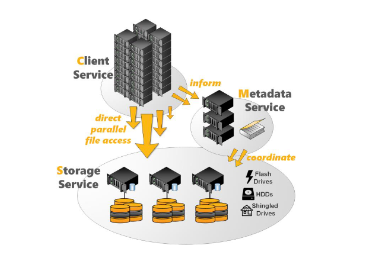

Die Speicherung von Daten bietet viele Facetten, die es zu berücksichtigen gilt. Das Spektrum reicht von Preis, zu Performance oder Accesability bis hin zu den spezifischen Anforderungen der Anwendung, welche auf die Daten zugreifen muss.

## Object Storage

Die **Object Storage** Architektur ist eines der drei am weitesten verbreiteten Cloud Storage Architekturen. Die Objekte bestehen aus den Daten selbst, einer variablen Anzahl an Metadaten und einer globalen einzigartigen ID (sog. GUID).
Objekt storage wird vorallem für die Speicherung unstrukturierter Daten genutzt. Bsp. Spotify Songs oder Bilder auf Facebook.
Services wie Amazon S3, Microsoft Azure Blob Storage, OpenStack Swift und Google Cloud Storage nutzen diese Architektur. Auf die Daten kann über eine API und somit über eine Netzwerk zugegriffen werden.

### Anwendungsfälle
* Speicherung von unstrukturierten Daten, wie Musik, Videos oder Fotos. 
* Speicherung von Backup Dateien, Logs etc.
* Archivierung von Daten

## Block Storage 
 
Block Storage bietet einer Instanz (z.B. VM) einen Speicher fester größe. Der Speicher nutzt meist die gängigen Dateisystemen. Entsprechend wird der speicher mit z.B. NTFS, FAT32 oder EXT4 formatiert. Block Storage Services sind z.B. [AWS EBS](https://aws.amazon.com/de/ebs/), Rackspace Block Storage, [Azure Disk Storage](https://azure.microsoft.com/en-us/services/storage/disks/). Auf Block Storage kann nur zugegriffen werden, wenn dieser an eine VM und dessen Betriebssystem angebunden ist.

### Andwendungsfälle
Block Storage wird für Datenbanken verwendet. Eine Datenbank braucht konsistenten I/O, sowie eine Verbindung mit geringer Latenz. Block Storage kann auch für RAID System genutzt werden. Dabei werden mehrere Block Storage Devices miteinander verknüpft und die RAID Operationen wie [Stripping](https://de.wikipedia.org/wiki/RAID#RAID_0:_Striping_%E2%80%93_Beschleunigung_ohne_Redundanz) und [Mirroring](https://de.wikipedia.org/wiki/RAID#RAID_1:_Mirroring_%E2%80%93_Spiegelung) können durchgeführt werden.
Für Serverseitige Datenverarbeitung bietet sich der einfache Block Storage an.


## Verteilte Dateisysteme

Verteilte Dateisysteme unterscheiden sich konzeptionell stark von Block Storage und Object Storage. Verteilte Dateisysteme müssen ähnliche Eigenschaften aufweisen wie Lokale Dateisysteme, aber über mehrere Systeme hinweg funktionieren.

Das Konzept von Verteilten Dateisystemen wird anhand von [BeeGFS](https://www.beegfs.io) gezeigt. BeeGFS ist ein verteiltes Dateisystem, welches von einem Institut der Fraunhofer Gesellschaft entwickelt worden ist. 

Applikationen sollen die Möglichkeit geboten bekommen eine POSIX-like Schnittstelle zu dem Dateisystem zu haben. Das heißt es wird sich von Datenbank-spezifischen Applikationsimplementierungen abgelöst. Dabei soll Applikation, die entsprechend auf pysikalisch unterschiedlichen Maschinen laufen, das selbe Dateisystem nutzen können. Im Gegensatz zu lokalen Dateisystemen muss nun unter anderem das Netzwerk berücksichtigt werden. Viele Schwierigkeiten wie Dateisynchronisationen und Pfadauflösungen entstehen, die ein ausgereifstes verteiltes Dateisystem lösen muss. Die Architektur besteht aus vier Komponenten. Ein Managment Server, mindestens ein Metadata Server, mindestens ein Storage Server und beliebig viele Clients. 

Der Managment Service dient als *Meeting Point* für alle teilnehmenden Komponenten. Der Mangment Service führt und verwaltet eine Liste der anderen BeeGFS Services und deren Zustand. Da der Service sehr leichtgewichtig ist, besteht die Möglichkeit ihn auf einem Server zu deployen, auf dem andere BeeGFS Komponenten laufen werden.

Ein Metadata Service speichert Informationen über Dateien. Die Metadaten die aus einem Lokalen Dateisystem bekannte sind, e.g. Ownership, Zugriffsrechte, File Location etc. werden von dem Metadata Service verwaltet und die Clienten bei Anfragen zu der erfragen Datei geführt. Die Location einer Datei ist nicht ganz einfach. Datein werden aufgeteilt. Dies geschieht über ein sog **Stripe Pattern**. Das Stripe Pattern verteilt Anteile einer Datei über die teilnehmenden Storages. Dies Kann Vor- und Nachteile haben. Falls Storages ausfallen entstehen (ohne replication etc. ) Schäden an den Dateien und demenstsprechend potentieller Dateiverlust. Striping kann zu einem Performanceanstieg führen, falls mehrere Knoten IO Operationen auf Dateien durchführen, die über mehrere Storages verteilt sind, da mehr IO Bandbreite genutzt wird.

Ein Storage Service ist die Kompoenten, die die Dateien der Nutzer speichert. Die Dateien sind *gestriped* und werden **data chunk files** gennant. Der Storage Service funktioniert mit den gewöhnlichen lokalen POSIX Dateisystem unter Linux. Jeglicher RAM, welcher von anderen Prozessen nicht genutzt wird, wird für Caching verwendet.

Die Metadata und die Storage Architektur basieren auf einem Scale-Out Design. Je mehr Instanzen an dem File System teilnehmen, desto größer ist die Performance.

Der Client registriert sich mit dem Virtuellen Dateisystem Interface von Linux. Es wird ein Custom Linux Kernel benötigt, der allerdings vollig automatisch von dem BeeGFS CLient installiert und configuriert wird. 


### Anwendungsfälle 
**Architektur von BeeGFS**

**Imagesource: *An Introduction to BeeGFS by Frank Herold, Sven Breuner June 2018***


### Weitere Distributed Filesystems
#### Hadoop Distributed File System (HDFS)

```
HDFS is designed for large files with write-once, read-many semantics.
```
HDFS nutzt extrem große Blocksizes für die Dateien. Die *Chunks*, d.h. Teile **einer**  Datei sind 128MB groß. Im Kontrast haben lokale Dateisysteme Blockgrößen von z.B. 4KB

HDFS ist nicht unter dem Aspekt der POSIX komptibilität designed worden. Deshalb werden verschiedene POSIX Semantiken nicht unterstützt. (e.g öffnen von existierenden Dateien um in diese zu schreiben).
#### Ceph FS
Ceph FS ist vielseitig und kann mit drei verschiedenen Interfaces angesprochen werden
* Ceph Object Gateway
* Ceph Block Device
* Ceph File System

Die Daten werden *zusammen* in dem Ceph Storage Cluster gelagert. 

```
Ceph FS, on the other hand is geared towards being a general-purpose distributed file system that can be used for a variety of applications deployed on a virtualized cluster. Ceph FS is a file system layered on top of a distributed object store. 
``` 
Sources: 
* [Understanding Object Storage and Block Storage Use Cases](https://cloudacademy.com/blog/object-storage-block-storage/)

* [Verteilte Dateisysteme unter Linux](https://blog.ordix.de/technologien/verteilte-dateisysteme-unter-linux)

* [Wikipedia: Object Storage](https://en.wikipedia.org/wiki/Object_storage#Cloud_storage)

* [Amazon: When to choose efs](https://aws.amazon.com/de/efs/when-to-choose-efs/)

* [A Survey of Distributed File System Technology By Jakob Blomer 2014](https://indico.cern.ch/event/258092/contributions/1588500/attachments/454164/629566/dfs.pdf)

* [HDFS vs Ceph](https://docs.microsoft.com/en-us/learn/modules/cmu-case-study-distributed-file-systems/4-hadoop-versus-ceph)