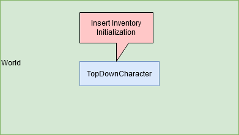
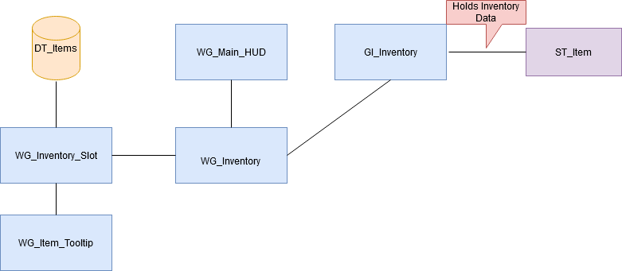
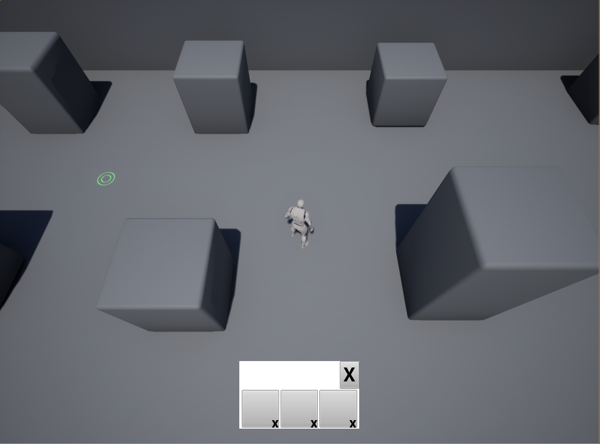

Ich wollte also nun irgendwas programmieren, anstatt Boxen zu platzieren, verschiebene und irgendwie groß und klein zu machen.
Dafür musste ich mir erstmal klar machen, was man überhaupt bauen kann. Bisschen inspirieren lassen und ein Ziel festgelegt.
Das gesetzte Ziel ist es, ein Inventar zu haben, in dem man Items drin sind. Diese items sollen Platzhalter für statische Mashes sein.
Wenn man ein Item anklickt und per drag and drop in die Welt wirft, soll das enstprechende Modell platziert werden. 

Der erste Schritt also war es, ein Inventar zu bauen. Programmieren kann ich. Blueprints kann ich nicht. 
Das heißt erstmal wieder Dokumentation lesen, Youtube Videos anschauen, und Foren durchforsten. Nachdem ich gute Richtungsweiser gefunden habe, ging es ran an die Arbeit.

Der Character sorgt bei seiner Initialisierung dabei, das die Initialisierungsfunktion des Inventories ausgeführt wird.
Dabei wird die in den Project Settings geänderte GameInstance für die Haltung der Inventory Daten genutzt. Eine extra GameInstance hilft später dabei, dass die Items im Inventar bei einem Levelwechsel nicht verloren gehen.

Die Initialisierungsfunktion bedient sich verschiedener Blueprints. Diese sorgen zum einem für die Darstellung innerhalb des HUD, z.B. wie ein Slot auszusehen hat, wie diese platziert werden (wrapped box), weitere Buttons wie z.B. ein X-Button um die Möglichkeit zu haben, das Inventar zu schließen.

Innerhalb der Slots können Items platz finden. Die Items beziehen ihre Informationen anhand ihrer Typs welche als Enum definiert sind und über die Datenbank abgefragt werden können.

Der erste Teil der Initialisierungsfunktion kümmert sich darum, dass die HUD Referenz von der Welt abgefragt wird. Anschließend wird ein Inventory Widget erstellt und der Variable *Inventory Panel* zugewiesen. Das Inventory Panel wird der HUD im Main Panel hinzugefügt. Die Anchors, also die Stelle an der das Inventart platziert werden soll, wird durch den Parameter bestimmt, der der Initialisierungsfunktion mitgegeben wurde. Das sind einfach passende X,Y Koordinaten. Je nachdem wo man das Inventar eben hinhaben möchte. Der Margin wird manuell an allen Seiten auf 0 gesetzt.

Der zweite Teil beschäftigt sich mit der Generierung der Slots anhand der gegeforderten Anzahl, die als Parameter beigegeben wurde. Mittels For-Schleife wird bis zum erreichen des Parameters ein Inventory_Slot erstellt. Jedem Invetory_Slot wird sein index als ID mitgegeben. Der neu erstelle Inventory_Slot wird dem Array Inventory_Slots im Inventory Panel hinzugefügt. Durch die *Add_Child_to_Wrap_Box* Funktion wird automatisch bei überschreitenden Größen ein Umbruch im Inventar durchgeführt. Anschließend wird eine Ausgabe getätigt, damit man weiß, das etwas passiert ist.

Im Fall, dass GI_Inventory bereits Items beinhaltet, werden die Daten aus dem Speicher geladen, der in GI_Inventory geführt wird und dazu genutzt, die Slots mit item zu füllen.
Falls keine Daten im GI_Inventory vorhanden sein sollte, werden diese als leeren Element dem Speicher hinzugefügt. Das passiert meist bei der Initialisierung

Durch diesen Aufbau hat es schonmal geklappt ein Inventar mit dynamischen Slots zu implementieren.

Hier zu sehen ist das vorerst nicht interaktive Inventar innerhalb eines Levels. Der erste Teil des Mini-Projekts ist damit schonmal erfolgreich =)

Der Youtube Kanal von Garrett Fredley hat eine gut Anleitung dazu, wie man ein Inventar System baut.