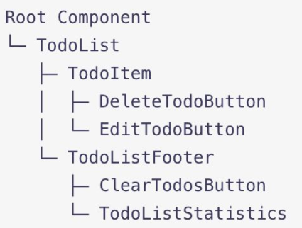
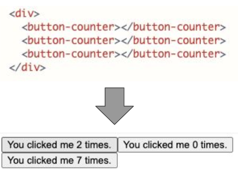

Der Begriff von Progressive Web Apps kommt von **progressive enhancement**. Je mehr Funktionalitäten dem Nutzer in seinem Browser zur Verfügung stehen, desto besser wird das Resultat. 


## Definition

```
Progressive Web Apps sind responsive und per HTTPS übertragene Webanwendungen, die nach dem Grundsatz des Progressive Enhancements die Fähigkeit der Browser für eine fortschreitende Verbesserung nutzen, wodurch mittels Offlinefunktionalitäten
über Service Worker, eine Installation anhand eines Web App Manifests und Push Notifications eine zuverlässige, motivierende native Nutzererfahrung gewährleistet wird.
```


## Eigenschaften

Progressive Web App ist eine flexible, adaptive App, die ausschließlich aus Web-Technologien besteht.
Folgende Eigenschaften sollte sie aufweisen:
* Discoverable
* Installable
* Linkable
* Network Independent
* Progressive
* Re-engageable
* Responsive
* Safe

PWAs sind über den Browser installierbar. Dementsprechend können Entwickler über das Web publishen. Das Updaten funktioniert auch über den Browser. Der Nutzer wird z.B. per Push-Benachrichtigungen über verfügbare Updates informiert. 
Die Kompatibilität ist sehr gut.

## Gangige Frameworks
* React
* vue.js
* Angular
* Preact
* Ember
* Svelte

## Tools
* PWA Builder
* Lighthouse

# Vue

Vue ist eine clientseitiges JavaScript Framework zum Erstellen von Benutzeroberflächen und Single-Page Applications.
Aktuelle Version ist 2.6.11 und 3.0.5
Vue ist vom MVVM-Pattern inspiriert.


## Hello Vue

```html
<!DOCTPYE html>
<html lang='en'>
<head>
    <meta charset='UTF-8'>
    <title>Hello World - Vue.js</title>
    <script type='text/javascript' src='https://unpkg.com/vue@next'></script>
<head>
<body>
    <div id='app'></div>
</body>
</html>
```


```html
<!DOCTPYE html>

<body>
    <div id='app'>{{ message }}</div>
    <script type='type/javascript'>
        const HelloVueApp  = {
            data() {
                return {
                    message: 'Hello World'
                }
            }
        }
        Vue.createApp(HelloVueApp).mount('#app')
    </script>
</body>
```

## Struktur

Jede Anwendung hat eine Wurzel-Komponente. Innerhalb dieser strukturiert sich die Anwendung mit Komponenten



Komponenten können Registriert werden
```js
// globales registrieren

app.component('todo-item', {
    template: `<li> this is a todo </li>`
})

// lokales registrieren

const ComponentA = {
    /* ... */
}

const ComponentB = {
    components: {
        'component-a' : ComponentA
    }
    //....
}
```
Zum Aufrufen wird der komponentenname verwendet:

```js
<ol>
    <todo-item></todo-item>
<ol>

```

## Aufbau

```js

app.component('button-counter', {
    data() {
        return {
            count: 0
        }
    },
    template: `
        <button @click='count++'>
            you clicked me {{ count }} times.
        </button>
    `
})
```




## Methoden


```js

const app = Vue.createApp({
     data() {
        return {
            count: 0
        }
    },
    methods: {
        increment(){
            this.count++
        }
    }
})

const vm = app.mount('#app')

console.log(vm.count) // => 4
vm.increment()
console.log(vm.count) // => 5

// Aufruf innerhalb einer View

<button @click='increment'> Up Vote</button>

```
## Lifecycle

Vue hat ein Lifecycle System für die Komponenten. Ähnlich wie Android-Mobile Entwicklung, React oder viele mehr.


## Props

Auch props sind vorhanden. Dies ist ähnlich wie in react.

```js

app.component('blog-post', {

    props: ['title']
    template: `<h4>{{title}}</h4>`
})

```

## Listen Rendering

```js
// In Model File
Vue.createApp('blog-post', {
    data() {
        return {
            myObject: {
                title: 'kekw',
                author: 'monkaS',
                publishData: '2021'
            }
        }
    }
}).mount('#v-for-object')

```

```html
// In View File
<ul id='#v-for-object' class='demo'>
    <li v-for='value in myObject'>
        {{ value}}
    </li>
</ul>
```

## Conditionals


```html
// In View File
<div v-if='Math.random() > 0.5'>
    now you see me
</div>
<div v-else>
    now you don't
</div>
```


## v-model

ermöglicht einfache bidirektionale Datenverbindung

z.B. in Vue 2:

```html
<ChildComponent v-model='pageTitle' />
```


Source:
Seminar im Rahmen des Web-Technologie Moduls an der THM
Vortragende:
* John Deutesfeld
* Marlin Brandstädter 
* Nils Mittler
* Stefanie Josefine Antonia Lehn
